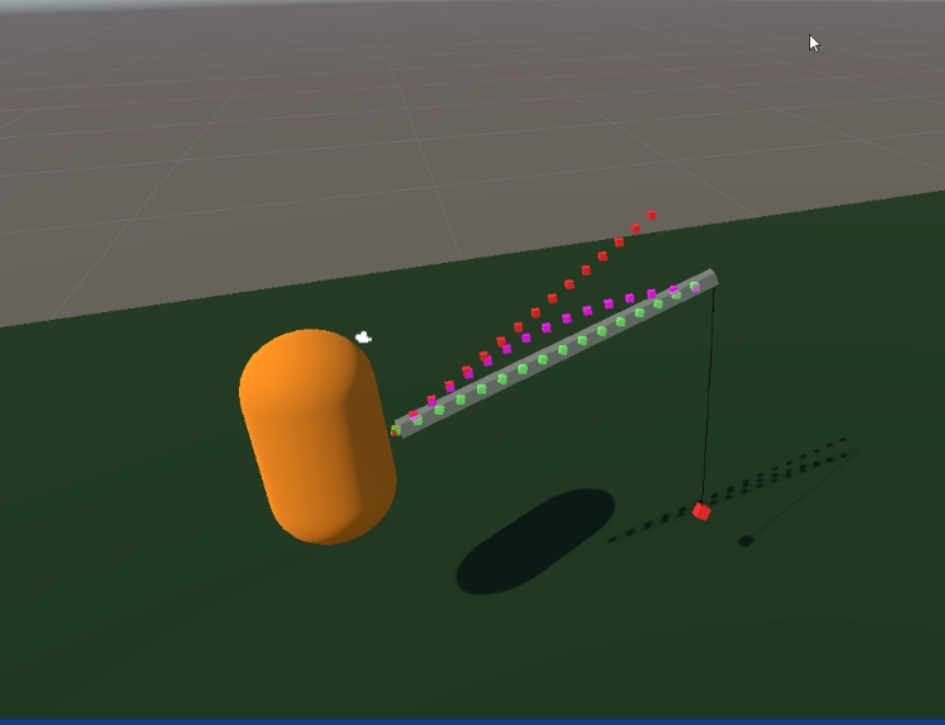
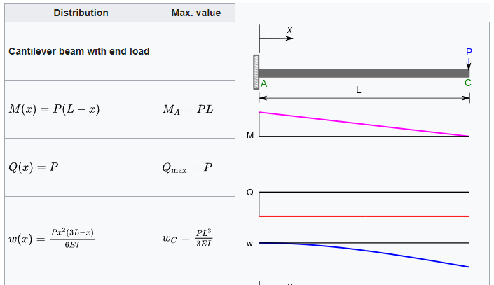

Prototype fishing rod bend for an abandoned fishing game.

This uses [Euler Bernoulli Beam Theory](https://en.wikipedia.org/wiki/Euler–Bernoulli_beam_theory) to simulate the fishing rod bending.






```c#
// CableComponent.cs

using UnityEngine;
using System;
using System.Collections;


public class CableComponent : MonoBehaviour {

	[SerializeField] private Transform endPoint;
	[SerializeField] private Material cableMaterial;

	[SerializeField] private float cableLength = 0.5f;
	[SerializeField] private int totalSegments = 5;
	[SerializeField] private float segmentsPerUnit = 2f;
	private int segments = 0;
	[SerializeField] private float cableWidth = 0.1f;

	[SerializeField] private int verletIterations = 1;
	[SerializeField] private int solverIterations = 1;
	[SerializeField] private float stiffness = 1f;
	private LineRenderer line;
	private CableParticle[] points;


	private void Start() {
		InitCableParticles();
		InitLineRenderer();
	}

	private void Update() {
		RenderCable();
	}

	private void FixedUpdate() {
		VerletIntegrate();
		SolveConstraints();
	}

	private void InitCableParticles(){
		if (totalSegments > 0) {
			segments = totalSegments;
		} else {
			segments = Mathf.CeilToInt (cableLength * segmentsPerUnit);
		}
		Vector3 cableDirection = (endPoint.position - transform.position).normalized;
		float initialSegmentLength = cableLength / segments;
		points = new CableParticle[segments + 1];
		for (int i = 0; i <= segments; i++) {
			Vector3 initialPosition = transform.position + (cableDirection * (initialSegmentLength * i));
			points[i] = new CableParticle(initialPosition);
		}
		CableParticle start = points[0];
		CableParticle end = points[segments];
		start.Bind(this.transform);
		end.Bind(endPoint.transform);
	}

	private void InitLineRenderer() {
		line = this.gameObject.AddComponent<LineRenderer>();
		line.SetWidth(cableWidth, cableWidth);
		line.SetVertexCount(segments + 1);
		line.material = cableMaterial;
		line.GetComponent<Renderer>().enabled = true;
	}

	private void RenderCable() {
		for (int pointIdx = 0; pointIdx < segments + 1; pointIdx++) {
			line.SetPosition(pointIdx, points [pointIdx].Position);
		}
	}

	// Verlet integration pass -every particle updates its position and speed.
	private void VerletIntegrate() {
		Vector3 gravityDisplacement = Time.fixedDeltaTime * Time.fixedDeltaTime * Physics.gravity;
		foreach (CableParticle particle in points) {
			particle.UpdateVerlet(gravityDisplacement);
		}
	}

	private void SolveConstraints() {
		SolveDistanceConstraint();
		SolveStiffnessConstraint();
	}

	private void SolveDistanceConstraint() {
		float segmentLength = cableLength / segments;
		for (int i = 0; i < segments; i++) {
			CableParticle particleA = points[i];
			CableParticle particleB = points[i + 1];
			SolveDistanceConstraint(particleA, particleB, segmentLength);
		}
	}

	private void SolveDistanceConstraint(CableParticle particleA, CableParticle particleB, float segmentLength) {
		Vector3 delta = particleB.Position - particleA.Position;
		float currentDistance = delta.magnitude;
		float errorFactor = (currentDistance - segmentLength) / currentDistance;

		// Only move free particles to satisfy constraints
		if (particleA.IsFree() && particleB.IsFree()) {
			particleA.Position += errorFactor * 0.5f * delta;
			particleB.Position -= errorFactor * 0.5f * delta;
		} else if (particleA.IsFree()) {
			particleA.Position += errorFactor * delta;
		} else if (particleB.IsFree()) {
			particleB.Position -= errorFactor * delta;
		}
	}

	private void SolveStiffnessConstraint() {
		float distance = (points[0].Position - points[segments].Position).magnitude;
		if (distance > cableLength) {
			foreach (CableParticle particle in points) {
				SolveStiffnessConstraint(particle, distance);
			}
		}	
	}

	/**
	 * TODO: I'll implement this constraint to reinforce cable stiffness 
	 * As the system has more particles, the verlet integration aproach 
	 * may get way too loose cable simulation. This constraint is intended to reinforce the cable stiffness.
	 * // throw new System.NotImplementedException ();
	**/
	void SolveStiffnessConstraint(CableParticle cableParticle, float distance) {
	}

}
```

```c#
// CableParticle.cs

using System.Collections;

public class CableParticle {

	private Vector3 _position, _oldPosition;
	private Transform _boundTo = null;
	private Rigidbody _boundRigid = null;


	public Vector3 Position {
		get { return _position; }
		set { _position = value; }
	}

	public Vector3 Velocity {
		get { return (_position - _oldPosition); }
	}

	public CableParticle(Vector3 newPosition) {
		_oldPosition = _position = newPosition;
	}

	public void UpdateVerlet(Vector3 gravityDisplacement) {
		if (this.IsBound()) {
			if (_boundRigid == null) {
				this.UpdatePosition(_boundTo.position);		
			} else {
				switch (_boundRigid.interpolation) {
					case RigidbodyInterpolation.Interpolate:
						this.UpdatePosition(_boundRigid.position + (_boundRigid.velocity * Time.fixedDeltaTime) / 2);
						break;
					case RigidbodyInterpolation.None:
					default:
						this.UpdatePosition(_boundRigid.position + _boundRigid.velocity * Time.fixedDeltaTime);
					break;
				}
			}
		} else {
			Vector3 newPosition = this.Position + this.Velocity + gravityDisplacement;
			this.UpdatePosition(newPosition);
		}
	}

	public void UpdatePosition(Vector3 newPos) {
		_oldPosition = _position;
		_position = newPos;
	}

	public void Bind(Transform to) {
		_boundTo = to;
		_boundRigid = to.GetComponent<Rigidbody>();
		_oldPosition = _position = _boundTo.position;
	}

	public void UnBind() {
		_boundTo = null;
		_boundRigid = null;
	}

	public bool IsFree() {
		return (_boundTo == null);
	}

	public bool IsBound() {
		return (_boundTo != null);
	}

}
```

```c#
// FishingRodBend.cs
using UnityEngine;
using System.Collections;

public class FishingRodBend : MonoBehaviour {

	private Transform[] bendyInterpolationPoints;
	private Transform[] rigidInterpolationPoints;
	private Transform[] deflectedPoints;

	public Transform deflectedParent;
	public Transform rigidPointParent;
	public Transform bendyPointParent;

	public GameObject pointPrefab;
	public Material redMat;
	public Material greenMat;
	public Material purpleMat;

	private float rodLength;
	private int interpolationAmount;
	private float interpolationRatio;

	private void Start() {
		rodLength = 12.0f;
		interpolationAmount = 16;
		interpolationRatio = rodLength / interpolationAmount;
		bendyInterpolationPoints = new Transform[interpolationAmount];
		rigidInterpolationPoints = new Transform[interpolationAmount];
		deflectedPoints = new Transform[interpolationAmount];

		CreatePoints (bendyInterpolationPoints, greenMat, bendyPointParent);
		CreatePoints (rigidInterpolationPoints, redMat, rigidPointParent);
		CreatePoints (deflectedPoints, purpleMat, deflectedParent);
	}

	private void FixedUpdate() {

		// Interpolate the points for the deflection
		for(int i = 0; i < interpolationAmount; i++) {
			Vector3 a = rigidInterpolationPoints [i].position;
			Vector3 b = bendyInterpolationPoints [i].position;
			deflectedPoints [i].position = a + (b - a) * Deflection((i * interpolationRatio) + interpolationRatio);
		}
	}

	//	Euler-Bernoull : Beam Theory -> Cantilever beam with end load, derived formula
	private float Deflection(float x) {
		return ((x * x) * (3 * rodLength - x) ) / (2 * (rodLength * rodLength * rodLength));
	}

	/* Helper method, used to create three sets of points for calculation */
	private void CreatePoints(Transform[] points, Material m, Transform parent) {
		for(int i = 0; i < interpolationAmount; i++) {
			float currentZ = i * interpolationRatio;
			GameObject tmp = (GameObject)Instantiate (pointPrefab);
			tmp.transform.SetParent (parent);
			tmp.transform.name = "Point (" + (i+1) + ")";
			tmp.transform.localPosition = new Vector3 (0, 0.0f, currentZ);
			tmp.transform.localScale = new Vector3 (0.25f, 0.25f, 0.25f);
			tmp.gameObject.GetComponent<Renderer> ().sharedMaterial = m;
			points [i] = tmp.transform;
		}
	}

}
```
