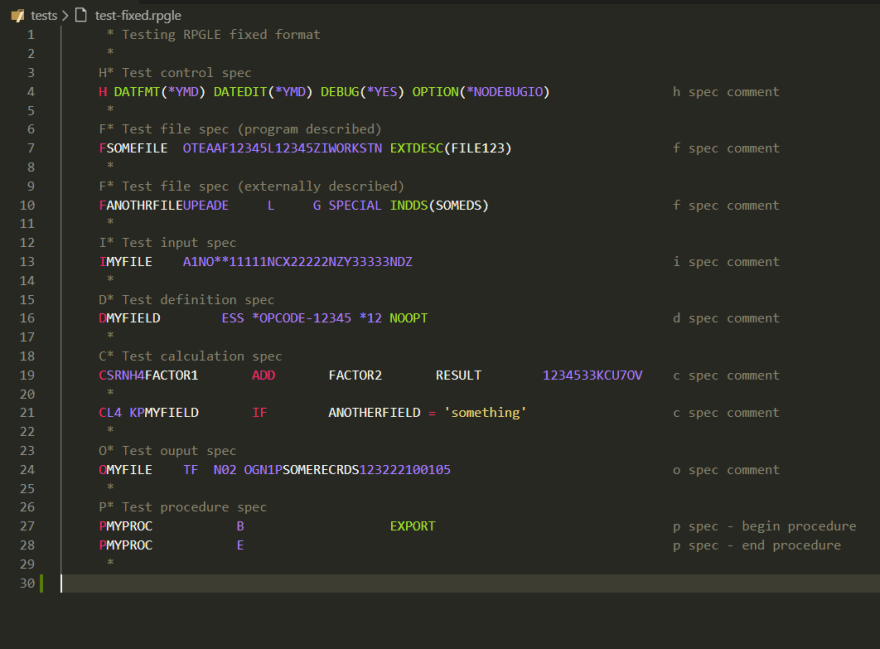

*Migrated post from [DEV.to](https://dev.to/barrettotte/writing-an-ibmi-syntax-highlighter-for-vs-code-4h0j)*



## Introduction

I love VS Code and really want it to be the "all in one" editor.
Unfortunately, there are still plenty of fringe cases that just don't work yet.

To make a long stort short, I recently started working as an IBMi developer. Its a **midrange system** (the middle ground between standard server and mainframe) that uses an old programming language called **RPG** (https://en.wikipedia.org/wiki/IBM_RPG, the same era as COBOL and FORTRAN).
So, I decided I wanted to be able to use VS Code to read IBMi code.

## Time to Learn Regular Expressions

A couple months ago I didn't know the black magic behind regular expressions.
In a prior side project (https://github.com/barrettotte/Ranger-Lang) I learned about compiler theory and finite automata. 
Which cleared the fog on the reasons why regular expressions exist and a bit of the syntax. I highly suggest taking a bit of time to read through some basic examples of finite automata to get a sense of what I'm talking about.

The rest of my learning was messing around for literal hours using https://regexr.com/ . This tool saved my life, it made things so easy to test.

Yes, it took me that long to get the hang of things; you have to be willing to put in the time when you're as dumb as me.

## Regular Expression Lookaround

One of the most valuable things to know how to do in regular expressions is lookaround.
A key concept to understand in regular expressions is that once a pattern is matched, the characters matched are "eaten" by the regex engine (they cannot be reused).
A lookaround allows you to match a pattern ahead or behind and does not consume the characters matched.

## Regular Expression Example

For example,
I had to make sure there was an 'F' in column 6, an 'F' or 'E' in column 14, and a certain set of words in column 41.

`     FPRINTER O   F     132     OF     PRINTER`

Using positive lookbehind, I can check the 'F', the 'F' or 'E', and 'PRINTER' while ensuring that all conditions are matched.

REGEX: `(?i)(?<=(?<=(?<=^[\s]{5}F).{8}).{4}(F|E).{20})(WORKSTN|DISK|PRINTER|SPECIAL|SEQ)`

This regex will lookbehind for two conditions and match a word (WORKSTN...SEQ) if the prior conditions are matched.

Broken down this is:

```text
(?i)               // case insensitive switch
(?<=               // start outer positive lookbehind
  (?<=             // start middle positive lookbehind 
    (?<=           // start inner positive lookbehind
      ^            // beginning of string
      [\s]{5}      // any non-whitespace character 5 times
      F            // 'F'
    )              // end inner positive lookbehind
    .{8}           // any character 8 times
  )                // end middle positive lookbehind
.{4}               // any character 4 times
(F|E)              // match either 'F' or 'E'
.{20}              // any character 20 times
)                  // end outer positive lookbehind
(WORKSTN|...|SEQ)  // match any word in list
```

At least for me, this didn't make much sense until I got my hands dirty.

## Introduction to TextMate

Atom and VS Code both use a thing called **TextMate** to handle all syntax highlighting. It provides a convenient way to list out sets of regular expressions that correspond to parts of a language such as constants, functions, keywords, operators, etc.

Googling around it seems that the TextMate grammars can be written in XML, JSON, and YML. I decided on JSON after screwing around with the YML version and not getting it working correctly (I think).

The previous regular expression example as a TextMate Grammar; I make (WORKSTN|...|SEQ) highlight as
a constant.

```json
{
  // ...
  "constants": {
    "patterns": [
      {
        "name": "constant.language.rpg.f.device",
        "match": "(?i)(?<=(?<=(?<=^[\\s]{5}F).{8}).{4}(F|E).{20})(WORKSTN|DISK|PRINTER|SPECIAL|SEQ)"
      }
    ]
  }
  // ...
}
```

There's also a lot more fancy things you can do with nested patterns, but I won't get into it here. If you're curious read more at https://www.apeth.com/nonblog/stories/textmatebundle.html

For fun, here's a link to Dart's syntax highlighter in TextMate https://github.com/Dart-Code/Dart-Code/blob/master/syntaxes/dart.json

## VS Code Language Extension

Another reason why I love VS Code is that they provide just enough documentation to get you started and let you go off on your own.

Language extensions are no exception, I just used this documentation page to get started https://code.visualstudio.com/api/language-extensions/overview

Everything else was achieved by looking around at existing extensions and screwing around with it.

## Putting It All Together

Using the basic knowledge I wrote above, I sat down one week and just kept hacking away.

For my particular extension, I sat down reading IBM's language documentation and making regex one piece at a time.
By the end of it I made my language extension support DDS, RPG, RPGLE (fixed and free formats), Control Language (CL), and Machine Interface (MI).
You can check out my extension at https://github.com/barrettotte/vscode-ibmi-languages

## Summary

Honestly, its not that hard of work its just insanely tedious and time consuming. But if you don't know how regular expressions really work, here is the perfect excuse to learn.

This is also the perfect weekend project to put on some music, drink some beer, and be a tiny bit productive while not working too hard.

