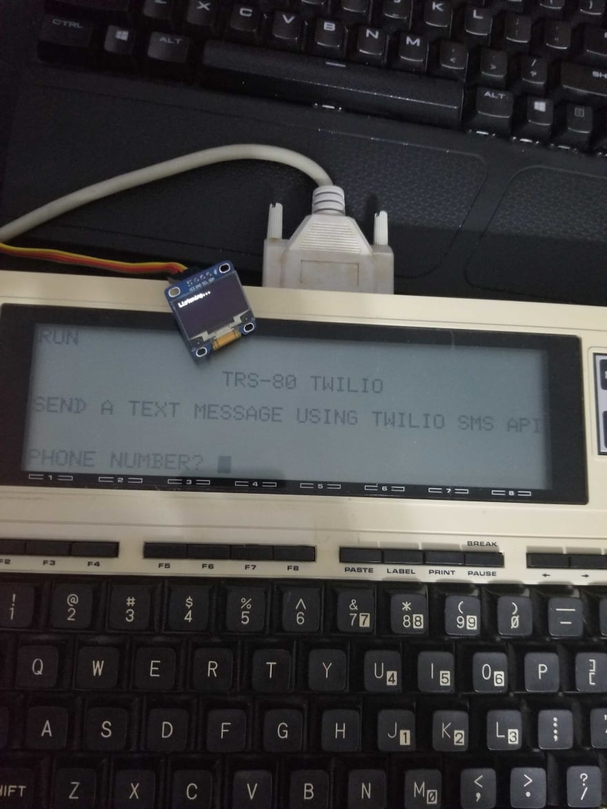
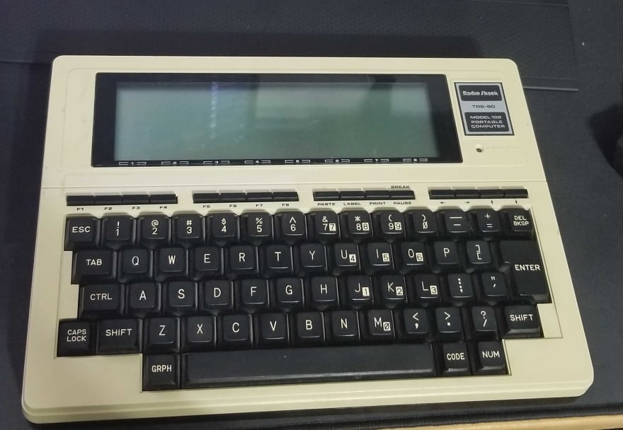
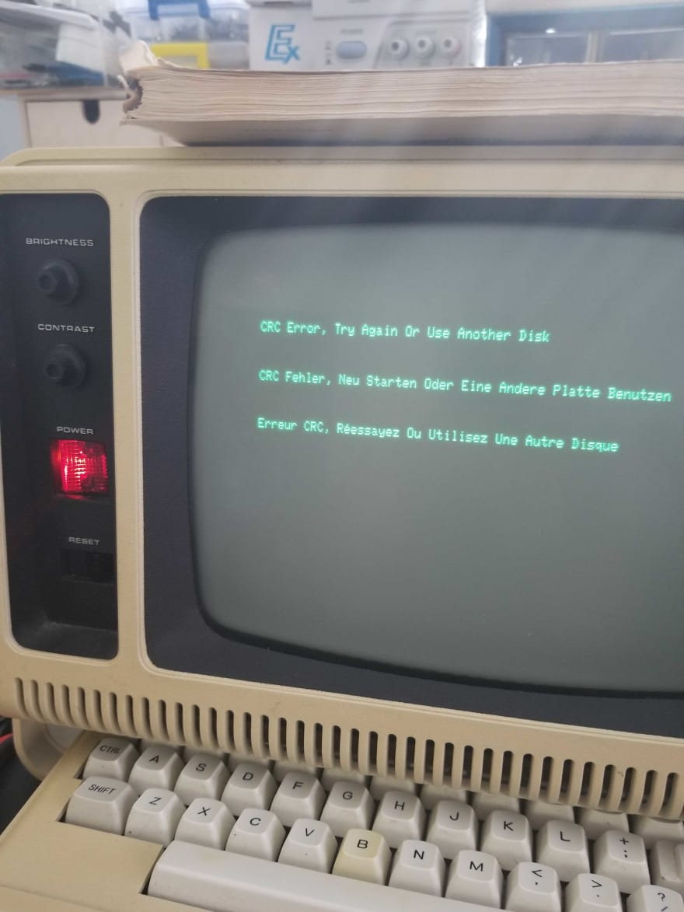
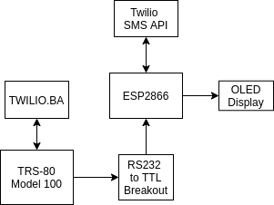

*Migrated post from [DEV.to](https://dev.to/barrettotte/trs80-twilio-sending-texts-like-its-1983-submission-450l)*

(This was a submission to a Twilio hackathon)

## What I built

### Category Submission: Exciting X-Factors

Send a text message from a TRS-80 Model 100 using the Twilio SMS API and an ESP8266.

**The basic goal was to use a vintage computer as a frontend and an ESP8266 as a backend to send a text message**.



As I state in my repository, **In no way is this practical or should be recreated. This was solely for fun; don't take this too seriously.**

I wanted to put the "HACK" in HACKATHON.

## Demo Link

An awful phone video showing this project in action with test credentials and "magic" test phone number. I figured it was better than nothing in case you wanted to see it actually running.
https://www.youtube.com/watch?v=C2nngeuc3Oc

## Link to Code

Check out some of the additional documentation I included, as well as some small test programs. https://github.com/barrettotte/TRS80-Twilio

## How I built it (what's the stack? did I run into issues or discover something new along the way?)



**Frontend:** TRS-80 Model 100, BASIC
**Backend:** ESP8266, Arduino platform, C++

After I decided I was going to participate in the Twilio hackathon I stumbled across documentation for using an ESP8266 to send an SMS. Naturally, I decided to take it a step further and make a complete coding abomination.
**The basic goal was to use a vintage computer as a frontend and an ESP8266 as a backend to send a text message**.
This probably won't get judged (I can't blame them), but this was one of the funnest projects I've ever done.

I started out making the "frontend" on a TRS-80 Model 4P using BASIC and Z80 assembly. In order to write to the Model 4P's serial port, I had to embed Z80 machine language in BASIC. Example of embedding machine language:
```
1   REM TEST EMBEDDED MACHINE LANGUAGE PROGRAM IN BASIC
10  DIM A%(12)
20  B = VARPTR(A%(0))
30  FOR I = 0 TO 11
40  READ C,D
50  E = D * 256 + C
60  IF E > 32767 THEN A%(I) = E - 65536 ELSE A%(I) = E
70  NEXT I
80  IF B > 32767 THEN DEFUSR0 = B - 65536 ELSE DEFUSR0 = B
90  X = USR0(0)
100 GOTO 90
105 REM ************* MACHINE LANGUAGE PGM *******************
110 DATA 33,64,60,17,0,60,1,192,3,237,176,33,192,63,62,32,6,64
120 DATA 119,35,16,252,201,0
125 REM ******************************************************
```

<br>

I woke up one morning and my old computer no longer worked...Read more in my [repo](https://github.com/barrettotte/TRS80-Twilio/tree/master/test/TRS80-4P).
I had no time to fix it.



So, I had to start from scratch 5 days before the due date of this hackathon.
I recently bought a cheap TRS-80 model 100, so I switched over to learning how it worked.

To my surprise, it was magnitudes easier to work with than the TRS-80 model 4P.
With the model 4P, I was forced to embed Z80 machine code into BASIC in order to write to its serial port.
With the model 100, all I had to do was open the serial port like a file and print to it...amazing.
The primary frontend file is [TWILIO.BAS](https://github.com/barrettotte/TRS80-Twilio/blob/master/TWILIO.BAS).
The frontend's job was to:
* provide a simple interface to input a phone number and message
* build a buffer of 145 bytes from user input
* basic phone number validation
* send buffer to the ESP8266 via RS232 (serial).

The "backend" was pretty easy to build. I recently refreshed on Arduino and learned how to use PlatformIO.
The biggest challenge with the backend was waiting for the incredibly slow serial port send all of the data. There was no good way to figure out when it was done. To solve this challenge, I decided to send a flat 145 bytes from the TRS-80 frontend each time. That way, I always knew that after reading 145 bytes I was done reading from the serial port.

The primary backend file is [src/main.cpp](https://github.com/barrettotte/TRS80-Twilio/blob/master/src/main.cpp)
The backend's job was to:
* establish connection to WiFi
* output helpful messages to OLED
* read serial input and parse buffer from TRS80
* establish connection to Twilio API
* build and invoke HTTP request to Twilio SMS API

In summary, this was one of the funnest projects I've ever worked on.
Truthfully, I wasn't sure if I was going to be able to pull this project off.
The reward of hacking away and completing this was huge.

Not to mention, I got to learn a lot about vintage computing and a bit about embedded development.

## Project Layout



```
### Basic Wiring ###

TRS80 DB25 --> DB25-DB9 Null Modem --> DB9 Male-Male --> TTL-RS232 ...

TTL-RS232   ESP8266      Mini OLED
              GND <----> GND
              3V3 <----> VCC
              D1  <----> SCL
              D2  <----> SDA
GND <-------> GND
VCC <-------> 3V3
TXD <-------> D6 (RXD)
RXD <-------> D5 (TXD)
```

## Additional Resources/Info

* [Introduction to PlatformIO](https://www.youtube.com/watch?v=0poh_2rBq7E)
* [TRS-80 Model 100 Manuals](http://www.classiccmp.org/dunfield/kyocera/index.htm)
* [Ira Goldklang's TRS-80 Revived Site](http://www.trs-80.com/wordpress/)
* [minicom manpages](https://manpages.ubuntu.com/manpages/trusty/man1/minicom.1.html)