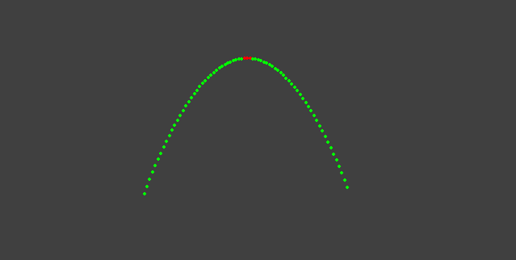
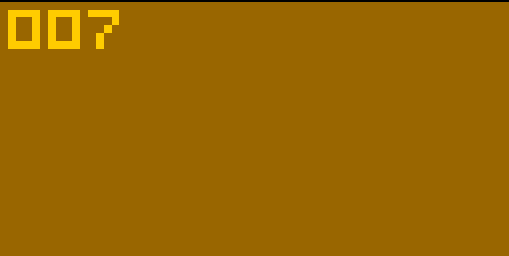

## Introduction to Octo

[Octo](https://github.com/JohnEarnest/Octo) is a high level assembler for an old virtual machine, 
[CHIP-8](https://en.wikipedia.org/wiki/CHIP-8),
which was developed in the mid-1970s. Its a VM with some basic audio, graphics, and input.
Game jams with constraints like this are the most fun.

I used the following resources to learn from:

- [Octo IDE](https://johnearnest.github.io/Octo/)
- [Octo Assembly Language Manual](https://github.com/JohnEarnest/Octo/blob/gh-pages/docs/Manual.md)
- [A Beginner's Guide to Programming with Chip8](https://github.com/JohnEarnest/Octo/blob/gh-pages/docs/BeginnersGuide.md)
- [An Intermediate Guide to Game Development with Chip8](https://github.com/JohnEarnest/Octo/blob/gh-pages/docs/IntermediateGuide.md)
- [Chip8 Programming Techniques](https://github.com/JohnEarnest/Octo/blob/gh-pages/docs/Chip8%20Programming.md)

## Octojam 7

I intended on attending a game jam called [Octojam 7](https://itch.io/jam/octojam-7) 
running from 10-01-2020 to 11-01-2020. This was a jam meant to be completed with only Octo.

My idea was a simple two player artillery game. Each player would change the angle and power of a projectile
to try to eliminate the other player. This would require inputs, audio, projectile motion calculation, and collisions.

While it was fun to learn Octo, I ended up not being able to complete anything to submit.
I had too many other projects going on that month and this one got taken off the list.
Hopefully in the future I can attend another one.

## Projectile Motion Prototype

The base projectile motion equations needed are:

$x(t) = x_0 + v_{0x}t\cos(\theta)$

$y(t) = y_0 + v_{0y}t\sin(\theta) - \frac{1}{2}gt^2$

So, with given values time $t$, projectile angle $\theta$, initial velocity $v_0$, 
and acceleration due to gravity $9.8\frac{\text{m}}{\text{s}^2}$
the values of $x$ and $y$ at time $t$ can be calculated.

Before starting in assembly, I put together a simple projectile motion prototype using pygame.



`game.py`

```py
import pygame, math, time

pygame.init()
(width, height) = (1200, 800)
screen = pygame.display.set_mode((width, height))
screen.fill((64, 64, 64))
clock = pygame.time.Clock()

pos_scale = 0.1      # scale position down so it fits on small screen
height_error = 0.01  # tolerable error for max height of projectile
g = 9.8              # gravity
theta = 45           # projectile angle

# initial values
v_0 = 250                                  # initial velocity (magnitude)
vx_0 = v_0 * math.cos(theta)               # initial velocity x component
vy_0 = v_0 * math.sin(theta)               # initial velocity y component
(x_0, y_0) = (width * 0.25, height * 0.5)  # initial positions

# estimations
flight_time = (2*vy_0) / g
max_height = ((vy_0**2) / (2*g)) * pos_scale

(x_pos, y_pos, t) = (0,0,0)

while True:
  for event in pygame.event.get():
    if event.type == pygame.QUIT:
      pygame.quit()
      exit()

  if y_pos <= y_0:
    color = (255,0,0) if y_pos < (max_height * (1 + height_error)) else (0,255,0)
    pygame.draw.circle(screen, color, (int(x_pos), int(y_pos)), 2)

    x_pos = x_0 + ((vx_0 * t * math.cos(theta)) * pos_scale)
    y_pos = y_0 - ((vy_0 * t * math.sin(theta) - (0.5 * g * (t**2))) * pos_scale)
    print('t = {}, pos = ({:2f}, {:2f})'.format(t, x_pos, y_pos))

    pygame.display.update()
    clock.tick(60)
    time.sleep(0.1)
    t += 0.50
```

## My "Entry"

This is the only thing I managed to code up. A BCD scoreboard controlled with the arrow keys.



`game.8o`

```
### Register map ###

# v0
# v1
# v2
# v3
# v4
# v5
# v6
# v7
:alias stk_ptr v8
# v9
# va
# vb
:alias vel_i vc
# vc - vel_x
# vd - vel_y
# ve
:alias flags vf

### Read write data ###

: stack 0 0 0 0 0 0 0 0
: bcd_buffer 0 0 0

# push register v to stack
:macro push v {
    i := stack
    i += stk_ptr
    save v
    stk_ptr += 1
}

# pop register v from stack
:macro pop v {
    stk_ptr += -1
    i := stack
    i += stk_ptr
    load v
}

: wait30
    v0 := 30
    delay := v0
    loop
        v0 := delay
        while v0 != 0
    again
;


# display bcd at pos (x,y)
: dsply_bcd
    i := bcd_buffer
    load v2
	
    # hundreds
    i := hex v0
    v0 := 1
    v3 := 1
    sprite v0 v3 5
  
    # tens
    i := hex v1
    v0 += 5
    sprite v0 v3 5
 
    # ones
    i := hex v2
    v0 += 5
    sprite v0 v3 5
;

# update bcd display with new value
#   IN  v0 - pos x
#   IN  v1 - pos y
#   IN  v2 - number
: write_bcd
    push v2
    dsply_bcd # off
    pop v2
    i := bcd_buffer
    bcd v2
    dsply_bcd # on
;

: init
    clear
    dsply_bcd
;

##############################################
#
#   Main game loop
#
##############################################
: main
    init
    loop
        v0 := 7 # left
        if v0 key begin
            v2 -= 1
            write_bcd
            wait30
        end
		
        v0 := 9 # right
        if v0 key begin
            v2 += 1
            write_bcd
            wait30
        end
		
        v0 := 5 # up
        if v0 key begin
            v2 += 1
            write_bcd
            v0 := 10
            wait30
        end
		
        v0 := 8 # down
        if v0 key begin
            v2 -= 1
            write_bcd
            v0 := 10
            wait30
        end
    again
;
```

