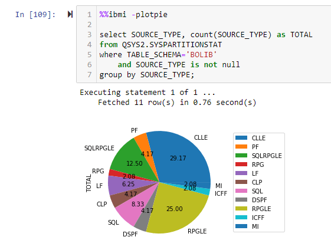
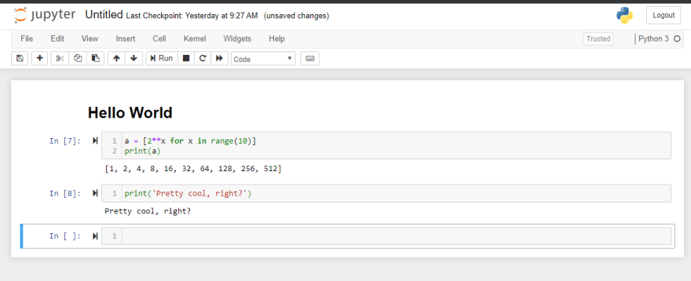
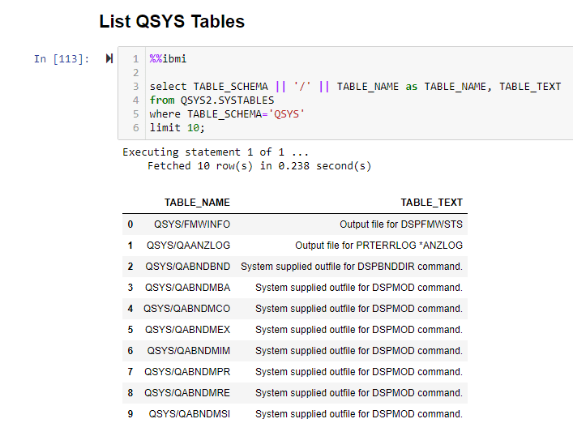
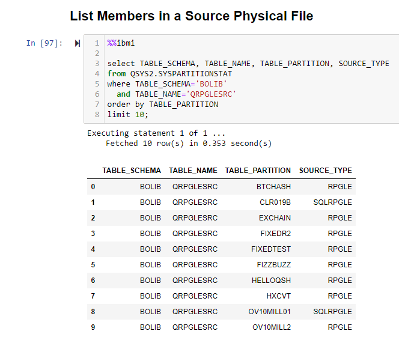
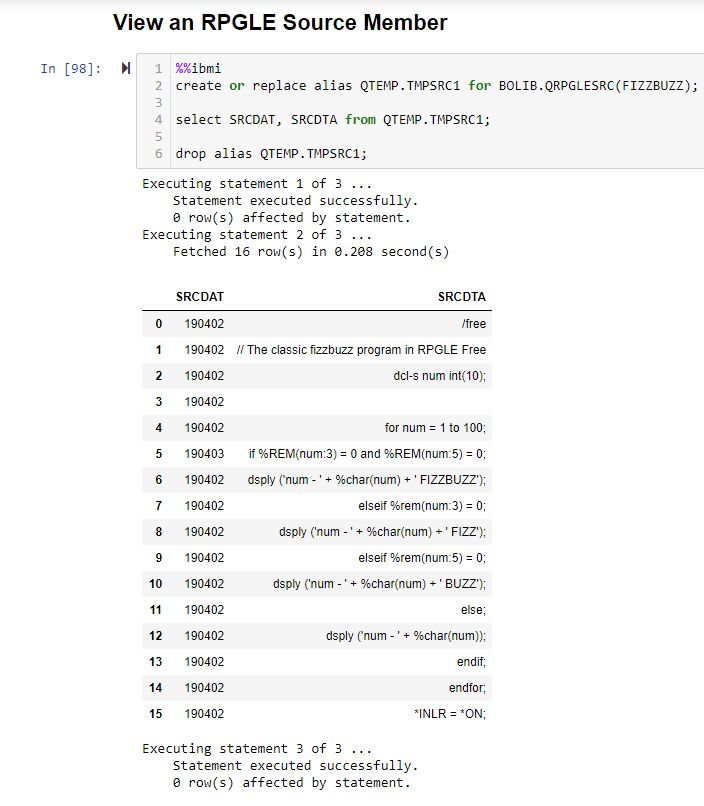
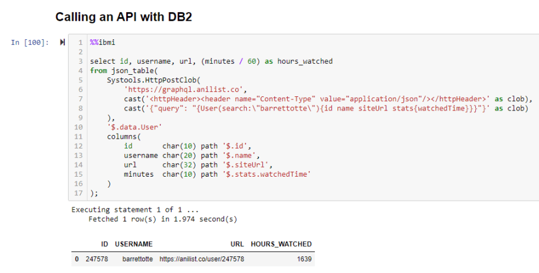
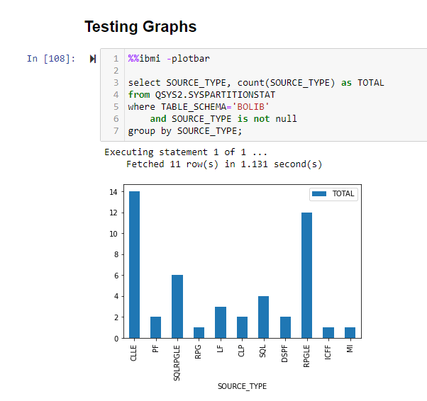
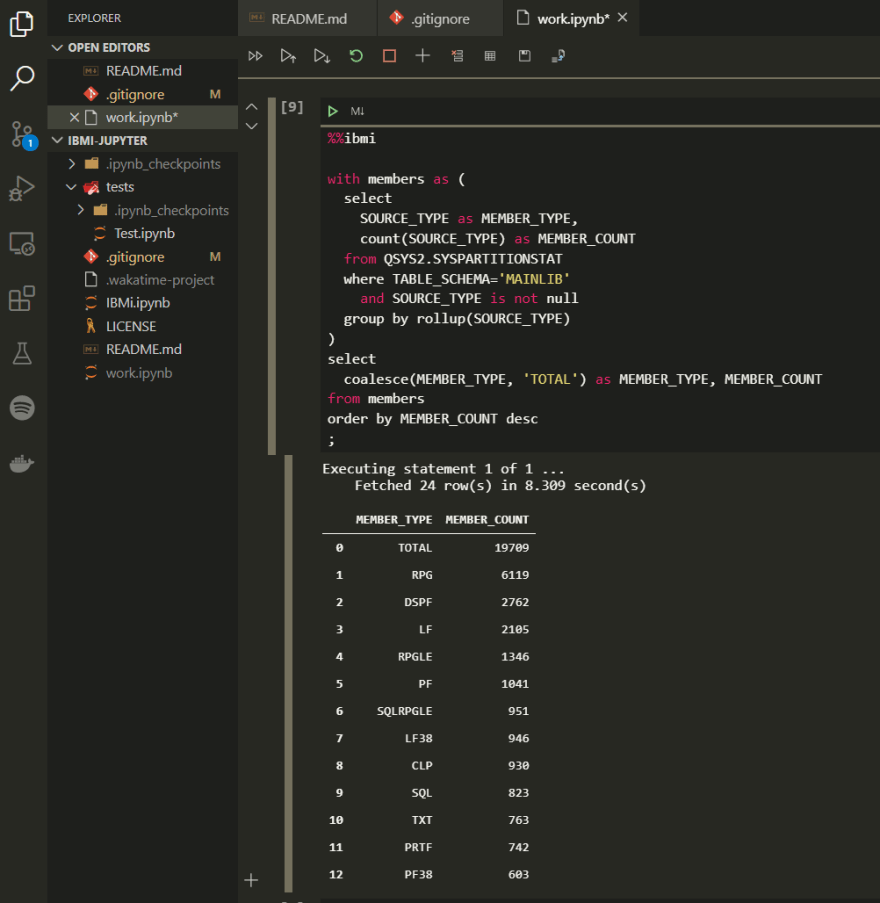

*Migrated post from [DEV.to](https://dev.to/barrettotte/jupyter-notebooks-ibmi-547g)*



This is going to be a short post on calling basic IBMi DB2 statements from Jupyter Notebooks. It is really light on explanation, so I encourage googling terms you are not familiar with.

## Briefest Introduction to Jupyter

Jupyter provides an environment for executing live code in a notebook like format. I find these especially useful for keeping "living notes" for mathematics and production support notes.

A notebook consists of cells, which allow you to mix and match SQL, Markdown, Python, Javascript, and much more in the same notebook.

Each cell can be executed independent of the other cells. So you can execute whatever cell you want.



This is a really basic example, but you can get the full power of pandas, numpy, matplotlib, etc to create some cool data visualizations. I won't be covering that because I'm pretty new to these modules still.

Notebooks can be shared easily to other developers. 
When the notebook is committed to a repository, it includes all of the output for each cell (if they were executed).
So, in a GitHub repository you can actually preview the notebook frozen in time.
Its pretty neat, you'll see some cooler stuff here soon.

I encourage you to go out and read more on Jupyter Notebooks.

## Setup

* Install dependencies - ```pip3 install jupyter pandas matplotlib numpy pyodbc``` (Pyodbc is for my IBMi example)
* Start Jupyter server - ```jupyter notebook```
* Hosted locally at **http://localhost:8888/notebooks** by default

## Why Pyodbc?

So, I made this post because calling IBMi is a little funky to do from Python and Jupyter. Most SQL Jupyter examples you'll come across use a Python module called SQL Alchemy. This module provides some convenience functions for interacting with a database. 

The driver for IBMi access does not work with SQL Alchemy. There is a repository in progress to get it working, but I don't think its ready yet - https://github.com/IBM/sqlalchemy-ibmi

But, that's okay we can still use the **pyodbc** module.
I won't go into a full example, but here is a link to my little eBook with an example program - https://barrettotte.github.io/IBMi-Book/#/additional/call/python

The most important bit is in the connection string:

```python
conn = pyodbc.connect(driver='{IBM i Access ODBC Driver}', system=host, uid=user, pwd=pwd)
```

It's slightly different than a lot of the examples you'll find floating around for connecting to DB2 and was slightly annoying to figure out at first.

## Small Utility Notebook

To make it even easier to work with IBMi on Jupyter I made a little utility notebook at https://github.com/barrettotte/IBMi-Jupyter

It includes some utilities for connecting and displaying result sets.
The main thing the utility notebook adds is some cell **magic**.
I won't go into too much detail, but it allows us to mark a cell to perform certain actions.

I added cell **magic** for DB2 for i. To mark a cell as DB2 for i, you include **%%ibmi**, which pretty much tells Jupyter to treat this cell special with whatever is defined for ibmi magic. The cell magic I defined takes in a single flag and a series of SQL statements delimited by a semicolon.

The SQL result set is returned as a **pandas dataframe**. I encourage you to read up on them. To summarize, they are convenient data structures used in a lot of data science packages.

Here is a summary of the flags I have currently implemented, they cause the cell magic to do things slightly different behind the scenes.

| flag        | description |
| ----------- | ----------- |
| -csv  | result set as CSV |
| -html | result set as HTML string |
| -json | result set as JSON string |
| -tex  | result set as LaTex string |
| -str  | result set as simple string |
| -xml  | result set as XML string |
| -plotbar  | result set as simple bar graph |
| -plotpie  | result set as simple pie graph |
| -plotline | result set as simple line graph |

Take a closer look at the cell magic in https://github.com/barrettotte/IBMi-Jupyter/blob/master/IBMi.ipynb

## Examples (finally)

To test out my utility notebook, I made a simple test notebook with a few queries.

To include the utility notebook in another notebook, invoke it with ```%run IBMi.ipynb``` (or whatever path you put it).
This will trigger the login, where it prompts for hostname, user, and password (kept as secret) using python inputs (getpass module for password). 

```
Enter host: DEV400
Enter user: OTTEB
Enter password: ········
Connecting to DEV400 as OTTEB ...
Successfully connected!
```

Now every cell afterwards will have access to the connection.
So let me show some example query screenshots, they are pretty self explanatory.
I skipped the JSON, XML, etc string examples because they weren't as cool to show.

All examples can be found in https://github.com/barrettotte/IBMi-Jupyter/blob/master/tests/Test.ipynb

<hr>



<hr>



<hr>



<hr>



<hr>



<hr>


<hr><br>

## Conclusion

This utility notebook is pretty barebones right now. But, maybe it will give somebody some ideas on a fun project to start on. As I get bored over some lunches at work I intend to add in more flags and features to make this more powerful.

The next thing I want to add is called **Line Magic** so we can use the result set we get back from a query. At the same time, I will add in prepared statements to the existing magic, so more complex visualizations can be made.

Feel free to yank the code for this and make something awesome.

EDIT:
I forgot to mention one of the other cool things. You can do all of this from VS Code as well. Jupyter Notebook support is bundled with the Python extension.
This means you can also have a basic DB2 for i SQL client in the comfort of VS Code.

