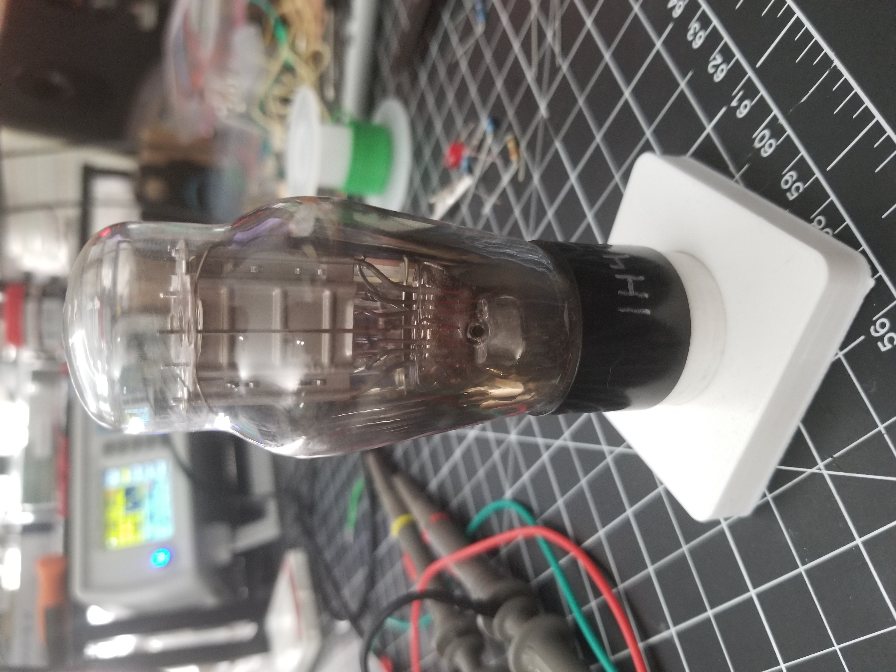
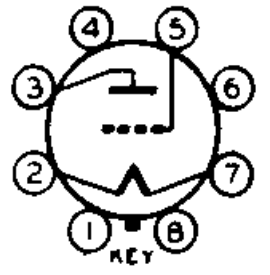
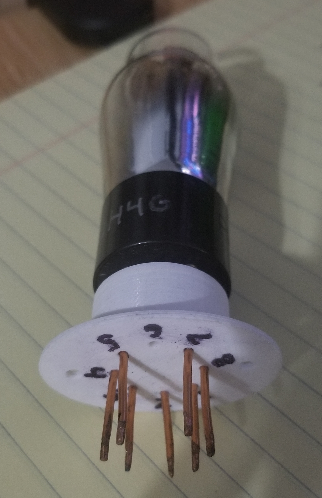
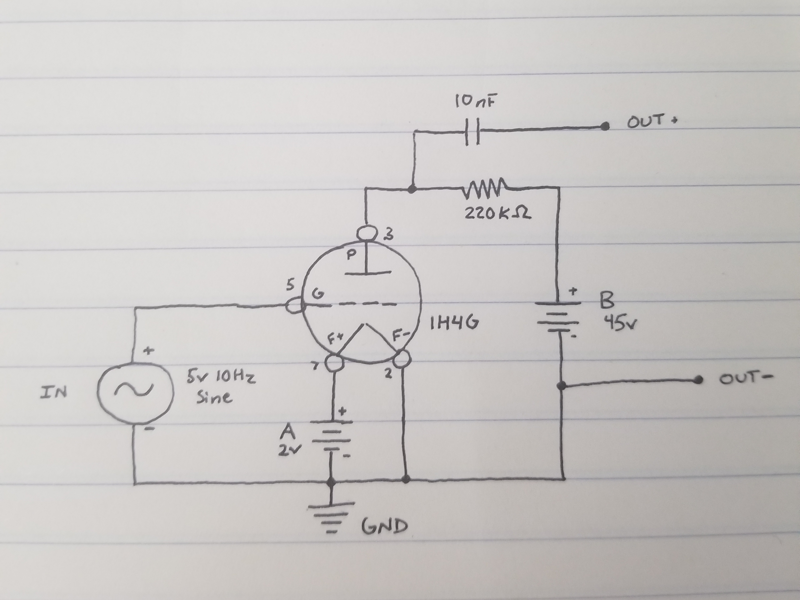
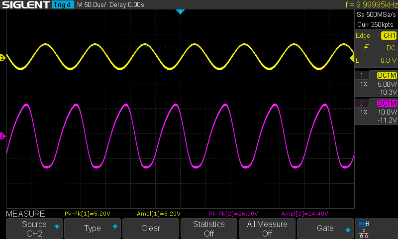

For a hobby project I needed to learn the basics of how vacuum tubes work.
I picked up [Inside the Vacuum Tube by John F. Rider](https://www.amazon.com/Inside-Vacuum-Tube-John-Rider/dp/1882580427) which
gave an awesome overview of the internals of vacuum tubes and a lot of the jargon.

To get a little more hands-on experience, I decided to build a really simple amplifier using an old 
vacuum tube dated around 1938.

## How a Triode Generally Works

The first triode, was the [Audion](https://www.historyofinformation.com/detail.php?id=563) invented by Lee de Forest in 1906. 
It was an electronic device designed to detect or amplify a signal. 

<figure style="margin-top: -15px; text-align: center">
  <a href="triode-diagram.png" target="_blank" rel="noopener noreferrer">
    
  </a>
  <figcaption>Triode with filament and cathode labeled. (<i><a href="https://en.wikipedia.org/wiki/Triode">Source</a></i>)</figcaption>
</figure>

A triode consists of three electrodes enclosed in an evacuated glass tube: A filament, grid, and plate.

The plate serves as the anode.

The filament is either directly or indirectly heated. Older vacuum tubes only have a filament, which will also serve as the cathode. 
But, newer tubes have a distinct cathode separate from the filament.
Electrons boil off the hot surface of the filament and are attracted to the positive charge of the plate (anode).
This action is known as [thermionic emission](https://en.wikipedia.org/wiki/Thermionic_emission).
Thomas Edison actually discovered this phenomenon and thermionic emission was previously known as the **Edison effect**, 
but he did not understand why it happened.

The grid, or control grid, is an electrode to control electron flow between the cathode and anode.
[Mr Carlson's Lab](https://www.youtube.com/watch?v=oHjZs0bNwEs&ab_channel=MrCarlson%27sLab) provided an easy way to understand how the control grid works. 
Simply imagine the control grid as Venetian blinds. 
When the control grid (Venetian blinds) is positive, the electrons from the filament (sunlight) flow (shine) strongly.
When the control grid is negative, the electrons are blocked and electrons are unable to flow.

## 1H4-G Tube

I have a couple pretty old **1H4-G** triodes on hand. This type of tube is considered a "detector amplifier triode".
I found two datasheets for this tube, both dated 1938:

- https://frank.pocnet.net/sheets/127/1/1H4G.pdf
- http://www.r-type.org/pdfs/1h4g.pdf

<figure style="text-align: center">
  <a href="1h4g.jpg" target="_blank" rel="noopener noreferrer">
    
  </a>
  <figcaption>1H4-G tube</figcaption>
</figure>

### 1H4-G Pinout

<figure style="text-align: center">
  <a href="1h4g-pinout.png" target="_blank" rel="noopener noreferrer">
    
  </a>
  <figcaption>1H4-G pinout. (<a href="http://www.r-type.org/pdfs/1h4g.pdf">Source</a>)</figcaption>
</figure>

Align tube with key to figure out pinout.

<ol>
  <li style="list-style: decimal">Not connected</li>
  <li style="list-style: decimal">Filament</li>
  <li style="list-style: decimal">Plate</li>
  <li style="list-style: decimal">Not connected</li>
  <li style="list-style: decimal">Grid</li>
  <li style="list-style: decimal">Not connected</li>
  <li style="list-style: decimal">Filament</li>
  <li style="list-style: decimal">Not connected</li>
</ol>

### Socket Saver

I created a repo named [vacuum-tube-toolbox](https://github.com/barrettotte/vacuum-tube-toolbox) to make it easier to start
messing around with vacuum tubes. For this tube, I 3D printed one
of my socket savers using the following OpenScad code:

```openscad
// 1h4g_socket.scad
//
// openscad -o 1h4g_socket.stl 1h4g_socket.scad

include <../VacuumTubes/sockets.scad>

$fs = 0.1;
$fn = 60;
tolerance = 0.1;

socket_mounted(pins=8, pin_diameter=3 + tolerance, pin_offset=8.5, socket_diameter=27.75, 
    socket_height=19.75, center_diameter=8.65 + tolerance, notch_length=2,
    mount_hole_diameter=3.1 + tolerance, mount_width=9, mount_height=7.5, mount_pin_diameter=2+tolerance);
```

Then, I created pin sockets by soldering copper foil and 1.5mm inner diameter magnet wire.

<figure style="text-align: center">
  <a href="1h4g-socket-saver.jpg" target="_blank" rel="noopener noreferrer">
    
  </a>
  <figcaption>Socket saver for 1H4-G, labeled with pinout.</figcaption>
</figure>

## Amplifier Circuit

Tube circuits of this era commonly used an "A battery" and "B battery.
The A battery is used to heat the filament and the B battery is used to charge the plate.
I used my DC power supply for the A battery; The filament ends up pulling around 0.05A (50mA) of current.
For the B battery, I wired five 9V batteries in series to produce 45V as the datasheet calls for.

This circuit will take in a 5V 10Hz sine wave from my signal generator and amplify it with the 1H4-G tube. 
I confirmed the circuit works with my oscilloscope and printed the results.

<figure style="text-align: center">
  <a href="amp-schematic.jpg" target="_blank" rel="noopener noreferrer">
    
  </a>
  <figcaption>Amplifier schematic</figcaption>
</figure>

<figure style="text-align: center">
  <a href="amp-breadboard.jpg" target="_blank" rel="noopener noreferrer">
    
  </a>
  <figcaption>Amplifier built on breadboard</figcaption>
</figure>

<figure style="text-align: center">
  <a href="oscillo-out.png" target="_blank" rel="noopener noreferrer">
    
  </a>
  <figcaption>Oscilloscope output of amplifier</figcaption>
</figure>
