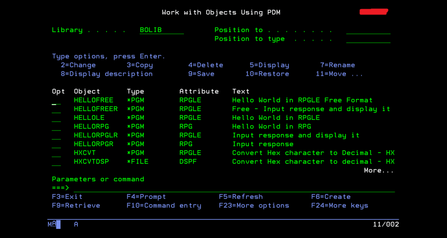
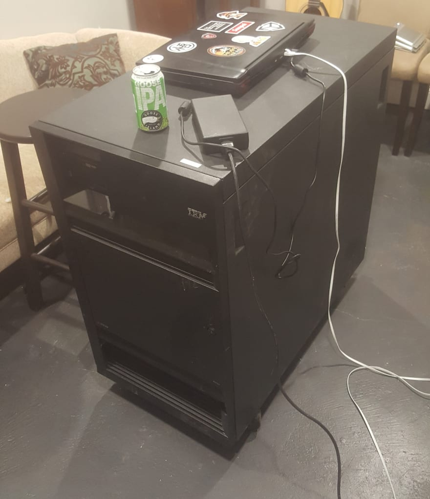
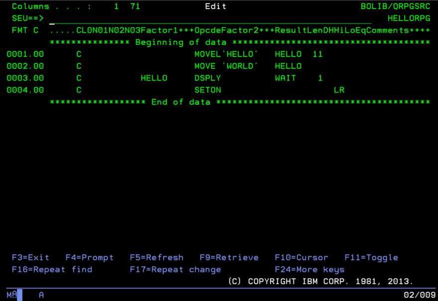

*Migrated post from [DEV.to](https://dev.to/barrettotte/rpg-and-the-ibmi-563)*

This is my first post to DEV to see if there are any developers on here who have messed around with IBM i before or are interested in learning what it is. Primarily, I will be focusing on the history of IBM i and the RPG programming language that has evolved with it.

At my current workplace, I noticed this ominous green and black screen on numerous older developers' monitors. Shortly after, I found out that my company develops and maintains an IBM i system with an RPG(LE) codebase. I was immediately intrigued and set out to learn what was happening. The problem is that learning a new paradigm of thinking is difficult.

Since I was a web developer and expressed a bit of interest in learning IBM i, I was given a user account and library that I could mess around with. I searched around various sites and some IBM documentation for a "tutorial". But, I quickly learned that there really isn't too great of a starting point compared to learning every other programming language and/or OS.

## An Important Lesson



If you ever find yourself wanting to learn RPG by purchasing a used AS/400 on eBay, don't do it (unless you have an additional $20K). IBM is cool, but their software is expensive and closed source. So, I have a pretty sweet 500lb bar table in my basement now.

## Brief Introduction

IBM i is an OS that works very well with business applications, reporting, data warehousing, and more. It also comes with a built in database called DB2 which uses its own little flavor of SQL. 

IBM i also has the ability to use many languages such as RPG, CL, DDS, COBOL, BASIC, C/C++, Java, Python, DB2 SQL, and REXX. There is a lot to this machine, but at a high level this amount of information should be sufficient.

A big selling point of IBM i is its stability. According to developers at my workplace, our IBM i system has only needed to be rebooted once in its 30+ years of operation.

## Brief History

IBM i evolved a lot over time and often gets confusing trying to google things. The easiest way to trace its evolution is to follow the RPG programming language.

* 1959ish [IBM 1400 series](https://en.wikipedia.org/wiki/IBM_1400_series) - **RPG I**
  * **Punch cards and magnetic tape**
  * Also supported COBOL, FORTRAN, and some ancient ASM languages.
* 1969-1977 [IBM System/3](https://en.wikipedia.org/wiki/IBM_System/3) - **RPG II**
  * Also supported COBOL, FORTRAN, BASIC
* 1978 [IBM System/38](https://en.wikipedia.org/wiki/IBM_System/38) - **RPG III**
  * Disk storage, diskette drive, etc.
  * Also supported COBOL, BASIC, PL/I
* 1988 [**Application System/400 - AS/400**](https://en.wikipedia.org/wiki/IBM_System_i) - **RPG 400/IV**
  * Also supported ASM, C/C++, COBOL, Python, REXX, and more.
* 2000 - renamed to iSeries
* 2006 - renamed to System i

I glossed over a lot of information, but feel free to read more.

## RPG



So, wait...RPG has been around since around **1960**? 

Yeah. 

**RPG (Report Program Generator)** started out on punch cards as a programming language that was used for generating reports. Over its life span, RPG received new features/changes and can currently be used like a general purpose programming language.

RPG fixed-format looks so ugly because of its origin. Therefore, RPG's grammar is dependent on certain columns needing specific data.

Gradually, RPG evolved out of its fixed-format ancestry and took a free-format appearance. IBM made sure that there was a decent amount of backwards compatibility between version of RPG. For example, on the AS/400 you could have a mix of RPG III and RPG IV programs. With RPG's evolution into free-format

RPG is sometimes referred to as RPGLE. Without getting into too much detail: On IBM i, there is the concept of **Integrated Language Environment (ILE)** languages. ILE languages can talk to other ILE languages. This includes CL, COBOL, C/C++, RPG, and more. Modern RPG development is typically using RPGLE.

### Hello World in fixed-format RPG (RPG III)

```
      C                     MOVEL'HELLO'   HELLO  11
      C                     MOVE 'WORLD'   HELLO
      C           HELLO     DSPLY          WAIT    1
      C                     SETON                     LR
```

### Hello World in fixed-format RPGLE (RPG IV)

```
      C     'Hello World' DSPLY
      C                   SETON                                        LR
```

### Hello World in free-format RPGLE (RPG IV)

```
       /free
       dsply ('Hello World');
       *inlr = *on
```


With the use of the **/free** and **/end-free** you can mix and match fixed and free RPGLE.

## Conclusion

This is just a small glimpse at IBM i. There is a mountain of information to learn about the machine, most of which I haven't learned yet. I know this was probably confusing, but I hope my writing was coherent enough to enjoy reading. If anyone would like to read and learn more about IBM i let me know in the comments. I'd love to keep making posts like this.

Possible future posts:
* What is Control Language (CL) ?
* What is Data Description Specification (DDS) ?
* IBM i file structure, Physical Files, and Logical Files
* Calling IBM i from Java, Python, and more
* Writing a basic RPGLE program

## My IBM i "Projects"

To start learning I made a small repository to dump random files and notes into; Located at https://github.com/barrettotte/IBM-RPG

I am writing a small "book" called "Learning IBM i as a Lowly Web Developer" (obviously the title is poking fun). This book will be a casual guide to IBM i , introductions to various obscure languages (RPGLE, CL, DDS, REXX, COBOL, etc), and a short course to wrap-up concepts. 

To go along with my book, I am casually developing an IBM i VS Code extension and editor API to enable viewing, editing, and compiling IBM i code from the comfort of VS Code.