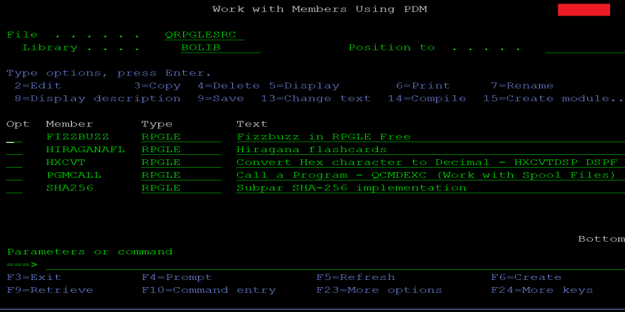
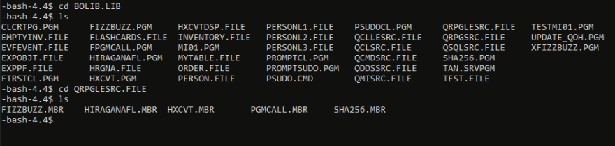

*Migrated post from [DEV.to](https://dev.to/barrettotte/simple-util-to-pull-code-from-the-ibmi-5hfp)*



In one of my really dumb side projects I'm making, I have some IBM i code that I'd like to keep in my git repository with some other stuff. I could use the Integrated File System (IFS), but truthfully I don't know enough about IBM i yet to use it correctly.

So, in the meantime I have a quick and dirty python script that lets me pull multiple source members based on a config file, repo.json. This isn't the cleanest, but it works pretty well.

My repo.json is very basic, but lays out a basic IBM i file structure to loop over below with FTP
```json
{
  "library": "BOLIB",
  "spfs": [
    {
      "name": "QRPGLESRC",
      "extension": "RPGLE",
      "members": [
        {
          "name": "FIZZBUZZ"
        }
      ]
    }
  ],
  "output": "./"
}
```

## Basic Idea

If you connect to IBM i over SSH you can navigate and find your source members. For example, I'm going to drill down into my QRPGLESRC file within my BOLIB library.



As you can see, there are my QRPGLESRC members hanging out. All my script does is automate grabbing the source members.

## The Code

To start, I use a few basic modules found in the python standard library.
```python
import ftplib  # easily setup FTP connection
import json    # read in repo.json config file
import getpass # used to discretely get password
import os      # used to safely make directories for output
```

I load my config file, instantiate my FTP client, and get the hostname, username, and password from the console
```python
config = {}
with open("./repo.json", 'r') as f: 
  config = json.load(f)

ftp_client = ftplib.FTP()
host = input("Enter Host: ")
user   = input("Enter User: ")
password = getpass.getpass("Enter Password: ")
# FTP logic below...
```

Next, I setup my FTP connection shell with very basic error handling
```python
try:
  ftp_client.connect(host, timeout=10000)
  ftp_client.login(user, password)
  # The meat of the code here ...
except ftplib.all_errors as e:
  print("Error occurred with FTP.\n" + str(e))
  exit(1)
except Exception as e:
  print("Some other error occurred\n" + str(e))
  exit(1)
finally:
  ftp_client.quit()
```

Now the fun stuff, sending FTP RETR command to get data from IBM i
```python
lib = config['library'] # my example only has one library, so no looping

for spf in config['spfs']:
  print("Fetching member(s) from {}/{}".format(lib, spf['name']))

  if not os.path.exists('./'+spf['name']): 
    os.makedirs(spf['name']) # make a directory based on source physical file name

    for mbr in spf['members']:
      resp = []

      # The magic command to get data  ex: BOLIB/QRPGLESRC/FIZZBUZZ.mbr
      cmd = "RETR {}".format("/QSYS.lib/{}.lib/{}.file/{}.mbr").format(
        lib, spf['name'], mbr['name'])

      ftp_client.retrlines(cmd, resp.append) # run the command

      # Create file based on specified extension ex: RPGLE
      filepath = spf['name'] + '/' + mbr['name'] + '.' + spf['extension']

      # Finally, write data to file
      with open(filepath, 'w+') as f:
        for line in resp: f.write(str(line) + '\n')

      print("  Saved " + filepath)
```

## Final Script

```python
import ftplib  # easily setup FTP connection
import json    # read in repo.json config file
import getpass # used to discretely get password
import os      # used to safely make directories for output

config = {}
with open("./repo.json", 'r') as f: 
  config = json.load(f)

ftp_client = ftplib.FTP()
host = input("Enter Host: ")
user   = input("Enter User: ")
password = getpass.getpass("Enter Password: ")

try:
  ftp_client.connect(host, timeout=10000)
  ftp_client.login(user, password)
  
  lib = config['library'] # my example only has one library, so no looping

  for spf in config['spfs']:
    print("Fetching member(s) from {}/{}".format(lib, spf['name']))

    if not os.path.exists('./'+spf['name']): 
      os.makedirs(spf['name']) # make a directory based on source physical file name

    for mbr in spf['members']:
      resp = []

      # The magic command to get data  ex: BOLIB/QRPGLESRC/FIZZBUZZ.mbr
      cmd = "RETR {}".format("/QSYS.lib/{}.lib/{}.file/{}.mbr").format(
        lib, spf['name'], mbr['name'])

      ftp_client.retrlines(cmd, resp.append) # run the command

      # Create file based on specified extension ex: RPGLE
      filepath = spf['name'] + '/' + mbr['name'] + '.' + spf['extension']

      # Finally, write data to file
      with open(filepath, 'w+') as f:
        for line in resp: f.write(str(line) + '\n')

      print("  Saved " + filepath)

except ftplib.all_errors as e:
  print("Error occurred with FTP.\n" + str(e))
  exit(1)
except Exception as e:
  print("Some other error occurred\n" + str(e))
  exit(1)
finally:
  ftp_client.quit()
```

## The File was Fetched!

This is stored in ./QRPGLESRC/FIZZBUZZ.RPGLE
```
       /free
       // The classic fizzbuzz program in RPGLE Free
       dcl-s num int(10);

       for num = 1 to 100;
           if %REM(num:3) = 0 and %REM(num:5) = 0;
               dsply ('num - ' + %char(num) + ' FIZZBUZZ');
           elseif %rem(num:3) = 0;
               dsply ('num - ' + %char(num) + ' FIZZ');
           elseif %rem(num:5) = 0;
               dsply ('num - ' + %char(num) + ' BUZZ');
           else;
               dsply ('num - ' + %char(num));
           endif;
       endfor;
       *INLR = *ON;
```

## Simple Batch script

In my repository, I made a little batch script so I could pull IBM i code and commit it with the rest of my repository in one call.

```shell
@ECHO OFF
IF [%1] == [] GOTO NOMSG
python ibmi-pull.py && git add . && git commit -m "%~1" && git push origin master
GOTO END
:NOMSG
  ECHO "Enter the commit message!"
:END
PAUSE
```

Again, there's probably some better "tools" you could make involving the IFS, but I'm just not there yet knowledge-wise.

As an experiment, I expanded upon this simple script to grab an entire library and generate a basic git repository : 
https://github.com/barrettotte/IBMi-Lib-Repo