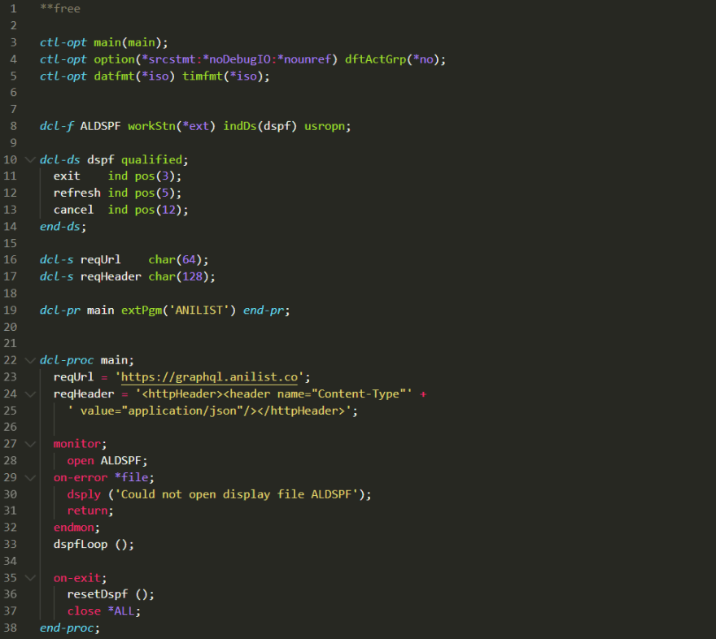
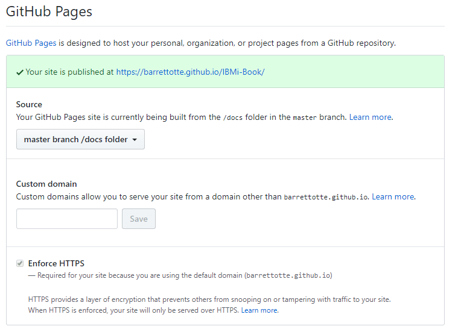

*Migrated post from [DEV.to](https://dev.to/barrettotte/write-a-book-with-docsify-3c0o)*


If you ever thought about writing a small book in the comfort of markdown/html then I would suggest using Docsify; https://github.com/docsifyjs/docsify

Docsify is pretty intuitive and has sufficient documentation to get you through the basics of putting together a book. Each directory is a section
and each markdown file is a page in the book. It also has other features such as navigation, cover pages, and sidebars that I haven't dove too deep into.

Since it uses markdown, you can also use standard HTML and CSS to style everything. I've had mixed results, but it seems like you can also use basic JavaScript as well. The only catch I've found so far is that you cannot use any asynchronous content. For example, I was unable to use embedded code snippets from https://www.cacher.io/ since it is an asynchronous request to cacher to get the content.

## Commands

* Install docsify cli through npm - `npm i -g docsify-cli`
* Start a new project - `docsify init mybook`
* Serve book locally on http://localhost:3000 - `docsify serve mybook`

## Sample Page

As expected, you can mix and match markdown and HTML depending on what you need to do. For all of my cases, this was perfect.

```markdown
<!-- Sample page from my book -->

## Introduction to the 5250 Emulator

This is an emulator of the IBM 5250 terminal originally used to interact with the IBMi and its ancestors. A bit more information on it here https://en.wikipedia.org/wiki/IBM_5250

There's a lot of features in this emulator that I haven't messed around with.

One important thing I learned is using the **popup keypad** located in **Actions** > **Popup Keypad...**
Sometimes when things go wrong, you have to use **SysReq** to bail yourself out (more on this later).

<figure align="center">
	
</figure>

```

## Code Blocks

One feature I wanted in my book was basic code blocks with a dark theme. Docsify uses a syntax highlighting package called [Prism JS](https://github.com/PrismJS/prism). For the most part, Prism JS works pretty well out of the box. To include syntax highlighting for PHP you would throw this into your **index.html**

```html
<!-- index.html -->
<script src="//unpkg.com/prismjs/components/prism-php.min.js"></script>
```

Unfortunately, I wasn't smart enough to figure out how to use the Prism plugin with Docsify (if you even can). I also tried to get line numbers working through a couple different CSS snippets, but I think my frontend abilities are severely lacking.

## Code Blocks with Monokai Theme

Additionally, I wanted to implement a dark theme like Monokai in VS Code.
I found a theme called **Xonokai** that was close enough to what I wanted
https://github.com/PrismJS/prism-themes . I also created a basic **styles.css** to do some additional tweaking on the Xonokai theme.

```css
/*styles.css*/

/* Hide php tag in code block */
#main > pre::after {
  display: none;
} 
#main > pre, #main > pre > code {
  background-color: #2e2e2e; 
}
#main > pre > code {
  color: white;
}
.sidebar, .sidebar-toggle {
  background-color: rgb(228, 228, 228);
}
```

As expected, you can link stylesheets in your **index.html**. I put all of my css in a root directory **_assets/css**.

```html
<!-- index.html -->
<link rel="stylesheet" href="./_assets/css/prism-xonokai.css">
<link rel="stylesheet" href="./_assets/css/styles.css">
```

Currently, this is what it looks like when its all said and done



## Additional Setup

I haven't gone super deep into docsify, but I've found a few cool things.
There's a pretty sweet plugin for pagination within chapters that can be added using

```html
<!-- index.html -->
<script src="//unpkg.com/docsify-pagination/dist/docsify-pagination.min.js">
```

A lot of customizing can be done within the **window.$docsify** element, here is my configuration that includes a homepage, repo link, and sidebar.

```html
<!-- index.html -->
<script>
    window.$docsify = {
      name: '',
      repo: 'https://github.com/barrettotte/IBMi-Book',
      loadSidebar: true,
      alias: {
        '/.*/_sidebar.md': '/_sidebar.md'
      },
      homepage: 'README.md',
      search: 'auto',
      auto2top: true
    }
  </script>
```

This is really just scratching the surface, but you can find much more at https://docsify.js.org/#/?id=docsify

## Deploying to GitHub Pages

If you put all of your book content within a **docs** directory of your repository, you can use your repository as a GitHub.io page with ease. To make sure that your repository isn't mistaken for a Jekyll site, create an empty file named **.nojekyll**.

To enable the GitHub.io page go to your GitHub repository and select **master branch /docs folder** in **Settings** > **GitHub Pages** > **Source**



## My "Book"

I hesitate to call what I'm making a book, but you can find my project **Learning the IBMi as a Lowly Web Developer** at https://barrettotte.github.io/IBMi-Book/#/

It will be a beginner's guide to programming on the IBMi with RPGLE, CL, and more. I hope to stay motivated/focused and keep chipping away at it.

Thanks for reading this post.