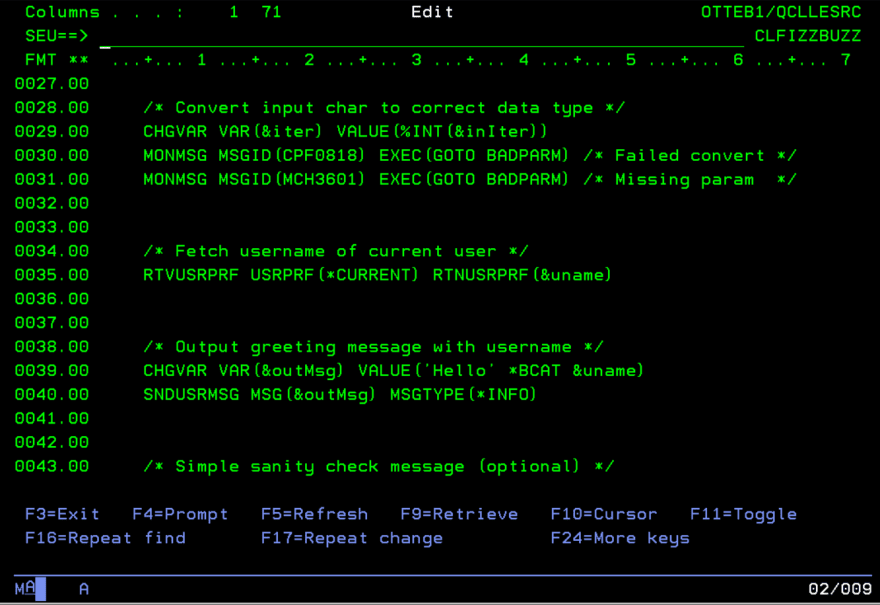

*Migrated post from [DEV.to](https://dev.to/barrettotte/ibmi-book-chapters-1-and-2-40ij)*

This is a post to say that I have "completed" the first two chapters of my small "book" **Learning IBM i as a Lowly Web Developer**. (Most of the core content is in an acceptable state, but may still be tweaked when I read it over for the millionth time).

The work in progress can be found at https://barrettotte.github.io/IBMi-Book/#/

## Preface

It should be obvious, but I'm not a writer and barely a programmer sometimes.
This book is lazy and heavily relies on "learning by example". Therefore, it might be tough for some people to follow. But, I do try to briefly explain and walkthrough writing each program.

I also decided to use SEU throughout this book just to get the full "green screen" experience. If you can code in SEU, you can code in something better be default.

I do mention [ILEditor](https://github.com/worksofbarry/ILEditor) and plan to include a brief overview of this awesome IDE so that people have the option to use it instead of ancient SEU.

## Chapter 1

https://barrettotte.github.io/IBMi-Book/#/core/ibmi/index

In chapter 1, I mainly go over operating system concepts and Access Client Solutions (ACS). This includes some Source Entry Utility (SEU) and Program Development Manager (PDM).

For practice, I walkthrough creating a library, source physical file, and a CL source member. Additionally, I step through compiling and running a three line CL program.

## Chapter 2

https://barrettotte.github.io/IBMi-Book/#/core/cl/index

In chapter 2, I give an overview of the syntax/structure of CL and start writing some basic CL. The example CL program I provided accepts user input via inquiry and echos it back to the user as a message.

For a more beefy example, I included a subpar implementation of fizzbuzz in CL to go over subroutines, conditionals, and loops. It could definitely be a better implementation, but I think it serves its purpose just fine.

## Conclusion

I hope to keep making progress on this book as I feel inspired. The next chapter is going to be on the basics of some old RPG and newer RPGLE. Additionally, I hope to add more content to the CL chapter on the differences between newer CLLE vs CL.

If you happen to read the book and have a suggestion on an improvement, please open an issue in my repository here https://barrettotte.github.io/IBMi-Book/#/ and I'll definitely consider it. After all, I'm still a complete noob to the IBMi and could use all the help I can get.

On a related note, my company allowed me to attend [RPG & DB2 Summit](https://www.systemideveloper.com/summit/conferences.html) in Minneapolis. I'm 23 so I'll be sticking out like a sore thumb around all the seasoned IBM i developers. I hope to learn a bunch of cool content to include/mention in this book.